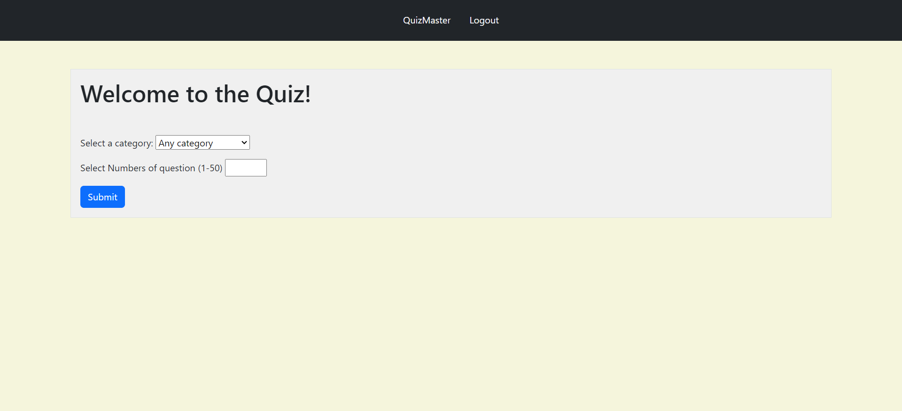
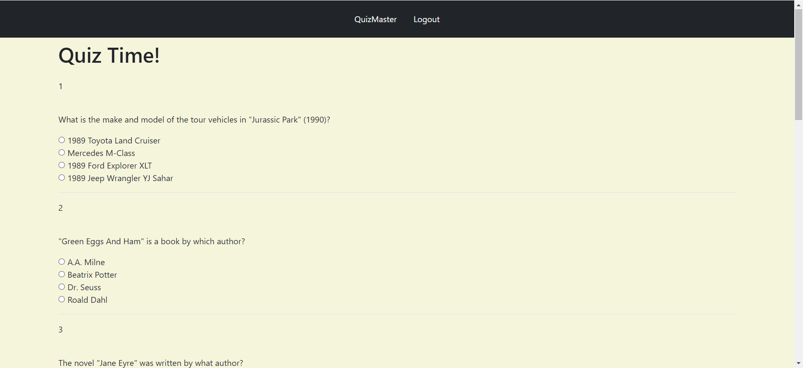
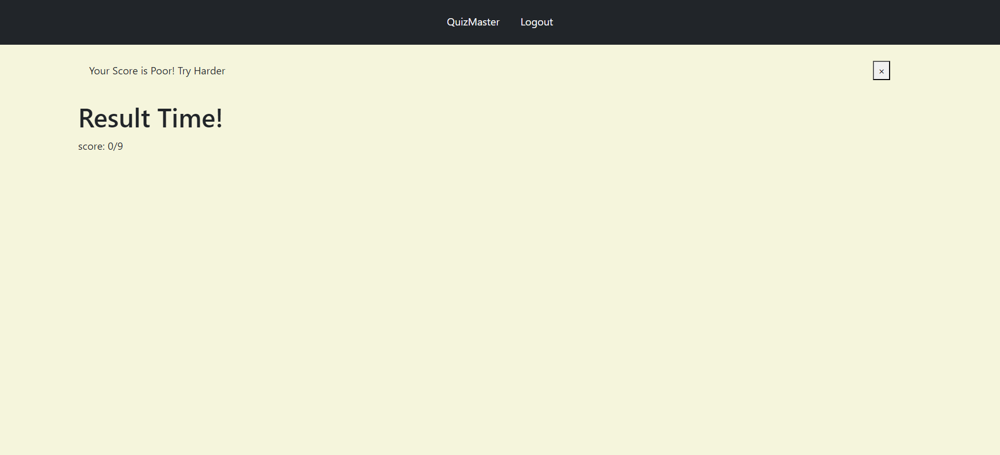

# Quiz Master

## Welcome to Quiz Master - Your Ultimate Quiz Solution!
Discover the fun and interactive way to test your knowledge 

---

## Navigation
- [Introduction](#introduction)
- [Features](#features)
- [About](#about)

## [Launch Quiz Master Demo](https://www.youtube.com/watch?v=wYLQdHQdOOY) {#launch-button}

---

## Introduction
Welcome to Quiz Master - Your Ultimate Quiz Solution!

---

## Key Features

### 1. Category Browsing and Filtering

**Category Browsing and Filtering**
- Easy browsing and filtering of quiz categories.
- Search functionality for specific topics.

### 1. Diverse Question Types

**Diverse Question Types**
-Support for multiple-choice, true/false.

### User Progress Tracking

**User Progress Tracking**
- Detailed statistics on quiz performance.

---

## Features
### User Registration and Authentication
User registration with username, email, and password.
Secure login and logout functionality.

### Pre-made Quizzes Library
Wide range of pre-made quizzes across different subjects.

### Diverse Question Types
Multiple-choice

### User-Friendly Interface
Enjoy an intuitive and easy-to-use interface for taking quizzes.

### User Progress Tracking
Detailed statistics on quiz performance.

### Category Browsing and Filtering
Easy browsing and filtering of quiz categories.
Search for specific topics.

### Integration with Open Trivia Database (OTDB)
Fetch trivia questions from OTDB for a diverse and extensive question bank.

---

## About

### Inspiration and Story

The inspiration for Quiz Master came from our personal experiences with interactive learning. Growing up in Africa, We always valued education but found traditional methods sometimes lacked engagement. We wanted to create a platform that made learning fun and accessible to everyone, no matter their background.

Over the past few months, We dedicated ourselves to developing Quiz Master, balancing our time between studying at Holberton School and working on this project. It's not just an assignment for our portfolio, but a reflection of our journey and growth as a full stack software engineer.

### Team Members

**Abdussalam Adam**
- LinkedIn: [LinkedIn Profile](https://www.linkedin.com/)
- GitHub: [GitHub Profile](https://github.com/Adams009)
- Twitter: [Twitter Profile](https://twitter.com/abdussa003)

**Ugwoke Levi**
- LinkedIn: [LinkedIn Profile](https://www.linkedin.com/)
- GitHub: [GitHub Profile](https://github.com/levoski1)
- Twitter: [Twitter Profile](https://twitter.com/)

**Georgina Emefa Kumah**
- LinkedIn: [LinkedIn Profile](https://www.linkedin.com/)
- GitHub: [GitHub Profile](https://github.com/GodsGiftLove)
- Twitter: [Twitter Profile](https://twitter.com/)

### Project Repository

Check out the project on GitHub: [Quiz Master Repository](https://github.com/Adams009/Master_Quiz)

---

## How It Works
1. Sign Up and create your account.
2. Browse through various quiz categories.
3. Select or create quizzes and start playing.
4. Track your progress and improve your knowledge.

## Benefits
### Engaging Quizzes
Make learning fun and interactive with engaging quizzes.

### Educational Value
Perfect for educational purposes, training, and knowledge reinforcement.

### Global Reach
Access quizzes from anywhere and at any time, globally.

# About the Developers

## Our Journey

Hello! We are an aspiring full stack software engineer from Africa, with a passion for coding and a dream to become the greatest full stack developer. Our journey in software development began with learning the basics of programming in C and Python. Over the years, We are always eager to learn and master new coding tricks.

## Our Vision

As we progressed in our career, We recognized the power of interactive learning and the potential it has to make education enjoyable and accessible. This realization inspired us to create the Quiz Master project. Our goal was to develop a platform that not only challenges users with engaging quizzes but also helps them track their progress and stay motivated.

## Looking Ahead

As we look to the future, We are excited about the possibilities that lie ahead. With the support of a vibrant community and the continuous evolution of technology. We are dedicated to this journey, striving to make a positive impact through innovative software development.

Thank you for being a part of this exciting journey with Quiz Master!

## Contact Information
For support or inquiries, please email us at [support@quizmaster.com](mailto:support@quizmaster.com)

## Footer
&copy; 2024 Quiz Master. All Rights Reserved.

[Privacy Policy](#privacy-policy) | [Terms of Service](#terms-of-service)

Follow us on [Facebook](#), [Twitter](#), [Instagram](#)
